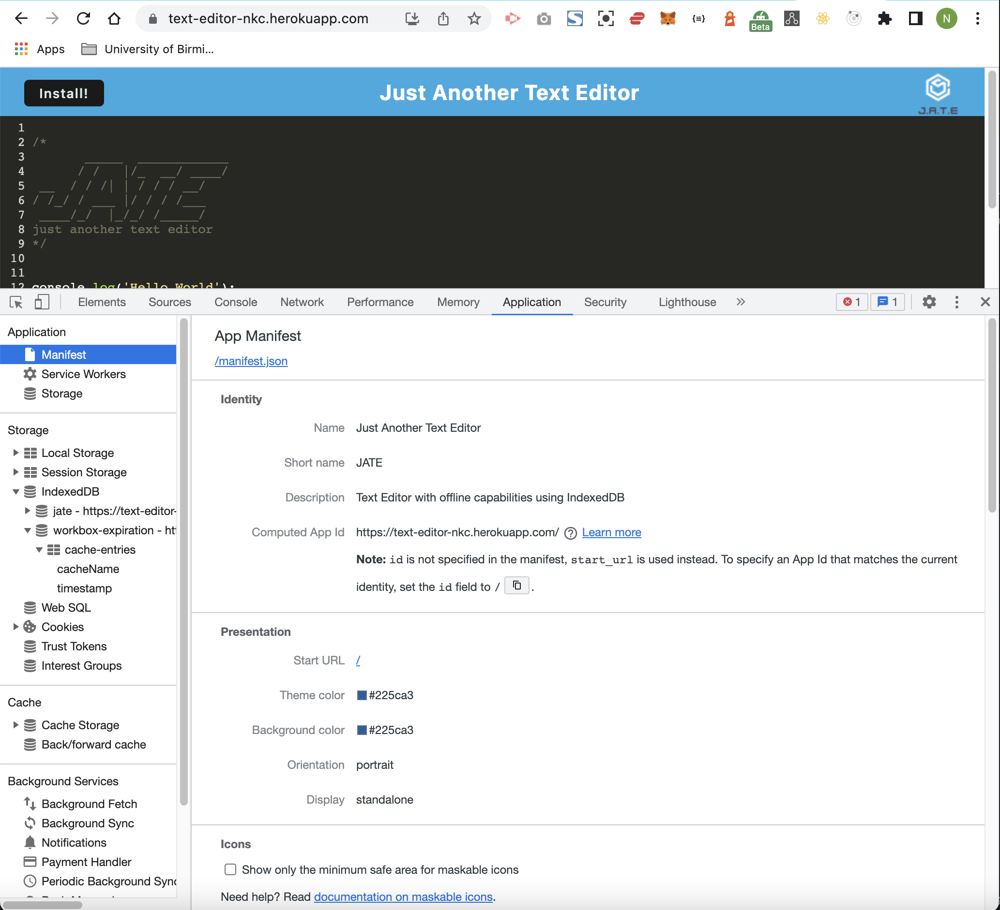

# J.A.T.E Text Editor
------------------------------------------------
## Description

Our task is to build a text editor that runs in the browser. The app will be a single-page application, it will feature a number of data persistence techniques that serve as redundancy in case one of the options is not supported by the browser. The application will also function offline.

## Installation

To build the J.A.T.E Text Editor, you will need to clone the repo and run the following commands in the Terminal:

```
1. npm install - To install dependencies
2. npm run start:dev
3. npm run start
4. then navigate to http://localhost:3000/ in your browser.
```

## Screenshots

The following animation demonstrates the application functionality:

## Text Editor Screenshot


------------------------------------------------

## Manifest Screenshot

The following image shows the application's `manifest.json` file:



------------------------------------------------
## Registered Service Worker

The following image shows the application's registered service worker:


------------------------------------------------
## IndexedDB

The following image shows the application's IndexedDB storage:


------------------------------------------------

## Deployed to Heroku

Please click on the link to view the finished deployed application on Heeroku:

[J.A.T.E Text Editor](https://text-editor-nkc.herokuapp.com/)

